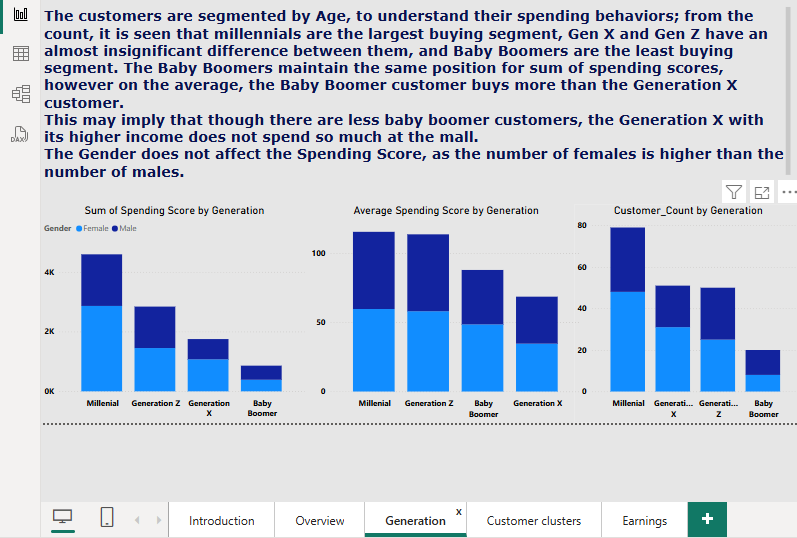

# Mall_Customer_Analysis
This repository is an analysis of the customers of a mall.

## Introduction ##
This is an analysis of the customers of a mall. 
Provided is a dataset consisting of 200 rows, 
and a header row containing the following columns, CustomerID, Gender,
Age, Annual Income($k) and Spending Score.

## Problem Statement ##
-	To create effective customer segments
-	To identify target customers as a way to develop suitable marketing strategies.
-	To understand customer behavior

## Skills Demonstrated ##
-	Data Transformation
-	Critical Thinking
-	Research
-	Exploratory Data Analysis
-	Microsoft Excel (Arithmetic functions, Data type conversion, Data Analysis ToolPak)
-	PowerBI (Conditional Columns, Measures, Visualizations)

## Data Source ##
This dataset was downloaded from Kaggle. You can find the dataset [here](https://www.kaggle.com/datasets/sonalisingh1411/mallcustomersdataset)

## Data Transformation ##
I segmented the following columns into categories ; Age, Annual Income and Spending Score.
For Age, I segmented the column into 
- Baby Boomers( Age >59)
- Generation X(44<= Age <= 59)
- Millennials (29<= Age<=43)
- Generation Z( Age <= 28)

[This](https://www.britannica.com/topic/Experience-the-American-Generations-Which-Generation-Are-You-2226598) served as a guide for segmenting the ages into generations.

For Annual Income, I used a histogram to view the data distribution, and determine its skewness as a guide to selecting the number of bins that would properly describe the data. Considering the range, mean, and median of the data, I found out that 7 bins helped describe the data better. Here are the 7 segments:
-	Annual Income <$20k: 		Entry Level
-	$20k <= Annual Income< $40k:	 Lower mid-range
-	$40k <= Annual Income< $60k:	 Mid-range
-	$60k <= Annual Income< $80k: 	Upper mid-range
-	$80k <= Annual Income< $100k: 	High income
-	$100k <= Annual Income< $120k: 	Very high income
-	Annual Income >=$120k:		Elite

For Spending Scores, I segmented the column into 4 parts
-	1-25:		Low Spenders
-	26-50:		Moderate Spenders
-	51-75:		Average Spenders
-	76-100: 	High Spenders

## Data Analysis and Visualization ##
### Exploratory Data Analysis ###

The Overview page shows a basic overview of the dataset, such as number of males and females, Average Annual Income and Average Spending Scores across the ages, this page shows results of exploratory data analysis, such as Count and Average.

### Analysis by Age generations ###
This analysis compares spending scores across different generations, and segments the columns by gender. Gender does not cause any significant change, though from the Exploratory Data Analysis, the frequency of women is higher than that of men, the pattern is maintained throughout the Analysis.

### Customer Segments ###

This analysis compares Annual Spending Scores and Annual Income, and I segmented it into clusters following the noticeable patterns, these clusters define their spending behaviors.
